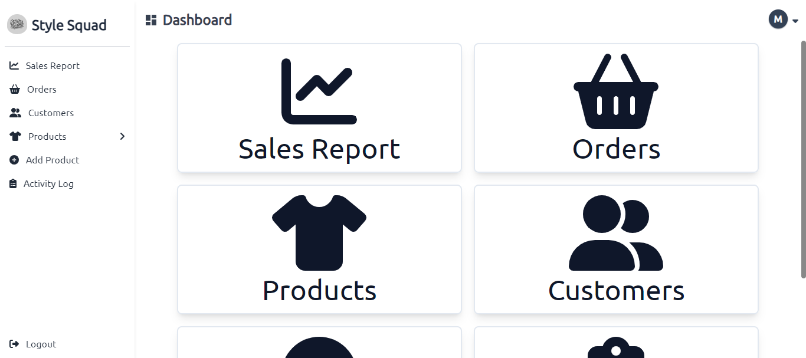
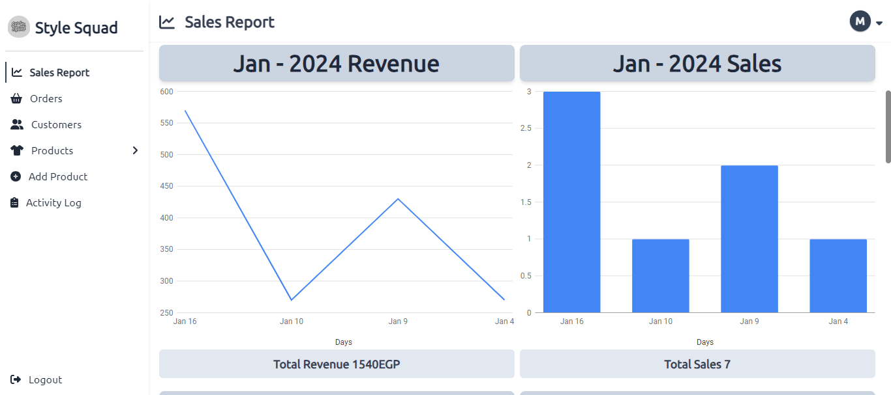
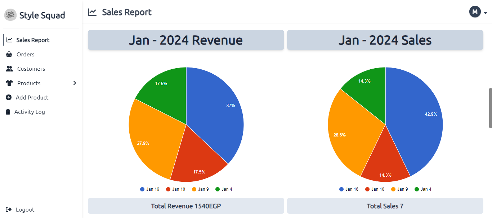
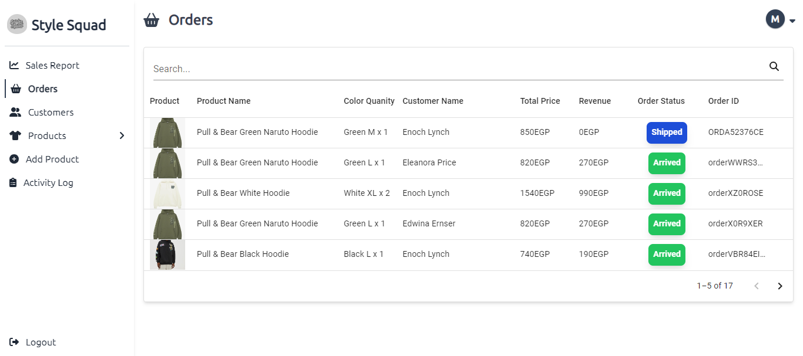
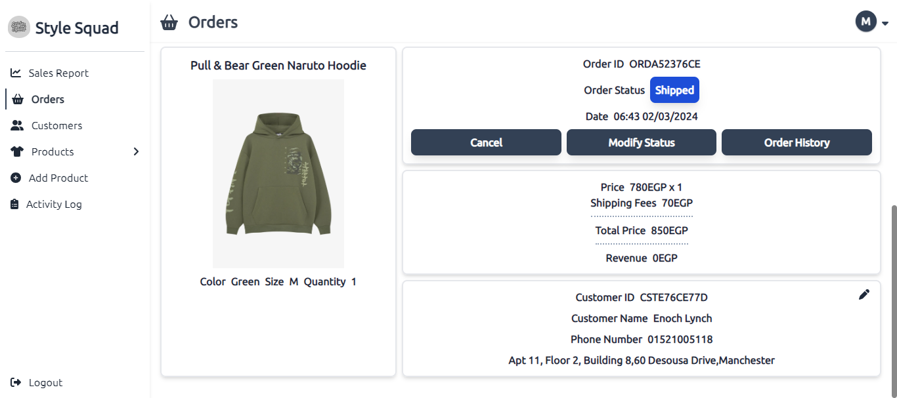
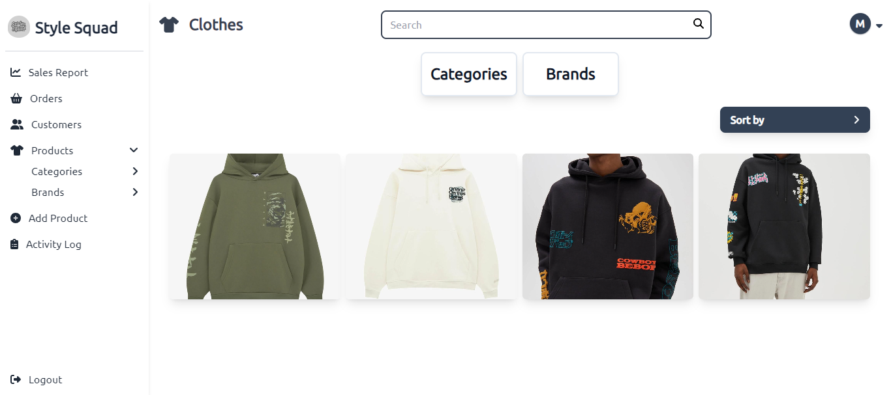
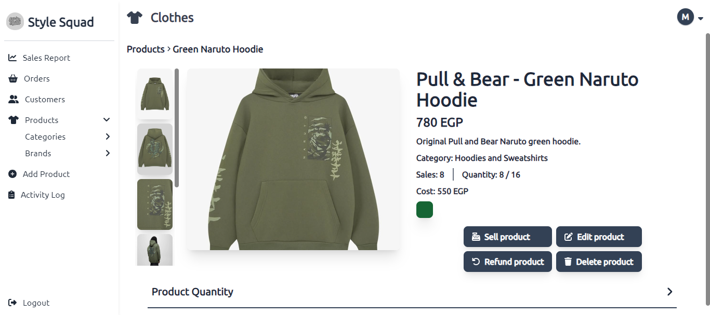
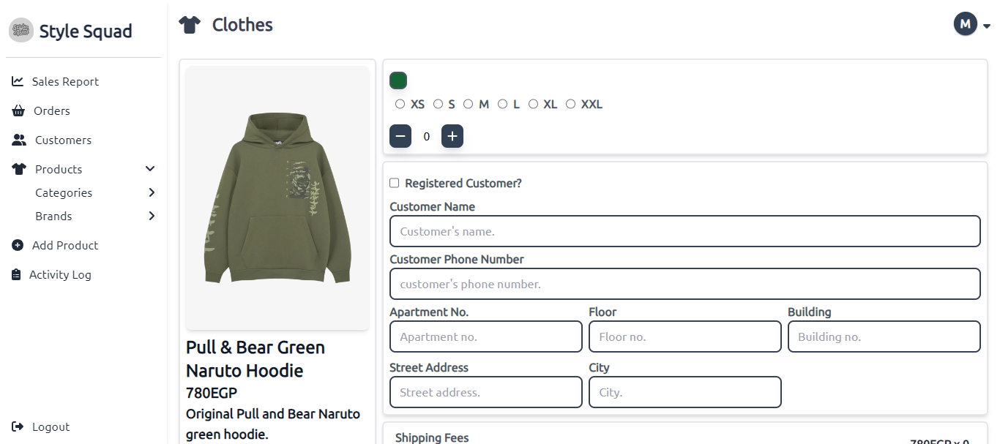
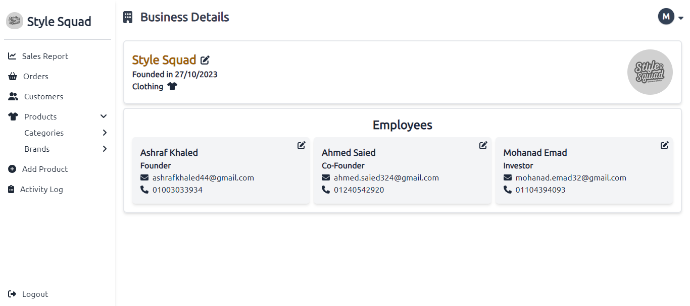
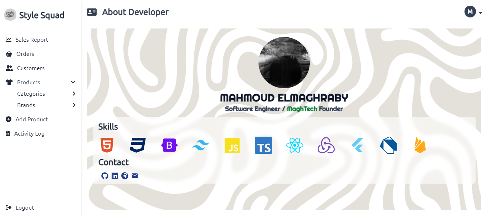

# eCommerce Dashboard

**Project Overview**

The eCommerce Dashboard is a comprehensive application developed using ReactJS to streamline business operations for e-commerce businesses. This dashboard includes various functionalities such as inventory management, order management, and accounting systems, making it a powerful tool for managing online stores efficiently.
## Features

- **Inventory Management System:** Keep track of stock levels, product details, and supplier information.
- **Order Management System:** Manage customer orders, track their status, and process shipments.
- **Accounting System:** Monitor financial performance, track expenses, and generate reports.
- **User-Friendly Interface:** Intuitive design for easy navigation and operation.
## Tech Stack

**Client-side**

- ReactJS: JavaScript library for building user interfaces.
- TailwindCSS: Utility-first CSS framework for building responsive designs.
- React Google Charts: For visualizing data and generating interactive charts.
- MaterialUI: Component library for React that implements Google’s Material Design.
- React Router: For managing navigation and routing within the app.
## Screenshots












## Demo

You can view a live demo of the project [here](https://ecommerce-platform-alpha.vercel.app//).
## Installation

1 - Clone the repository:

```bash
  git clone https://github.com/maghrabyy/eCommerce-Platform.git
```
2 - Navigate to the project directory:

```bash
cd eCommerce-Platform

```

3 - Install the necessary dependencies:

```bash
npm install

```

4 - Start the development server:

```bash
npm start

```
    
## Project Structure

The project is organized for modular development, making it easy to maintain and extend. Here’s an overview of the structure:

- **/src**
  - **/assets:** Contains images, icons, and other    static assets.
  - **/components:** Reusable components for various functionalities and UI elements.
  - **/context:** Context API setup for state management and sharing data across components.
  - **/pages:** Different pages and routes for the dashboard functionalities.
## Contributing

Feel free to submit issues or pull requests to improve the functionality or UI. Contributions are welcome!


## License
This project is licensed under the MIT License.


[MIT](https://choosealicense.com/licenses/mit/)


## 🚀 About Me

Hello! I’m Mahmoud Elmaghraby, a passionate and motivated software developer specializing in frontend development. I have strong proficiency in ReactJS and NextJS, and I am familiar with the complete software development life cycle. I recently graduated from the Information Technology Institute (ITI), where I completed an intensive training program in the Frontend and Cross-Platform Mobile Development track.

I have worked on several projects, including eCommerce platforms and cross-platform mobile applications, and I’m always eager to take on new challenges that help me grow as a developer. Feel free to check out my other repositories or connect with me for collaborations!

- GitHub: [maghrabyy](https://github.com/maghrabyy)
- LinkedIn: [Mahmoud Elmaghraby](https://linkedin.com/in/maghrabyy)
